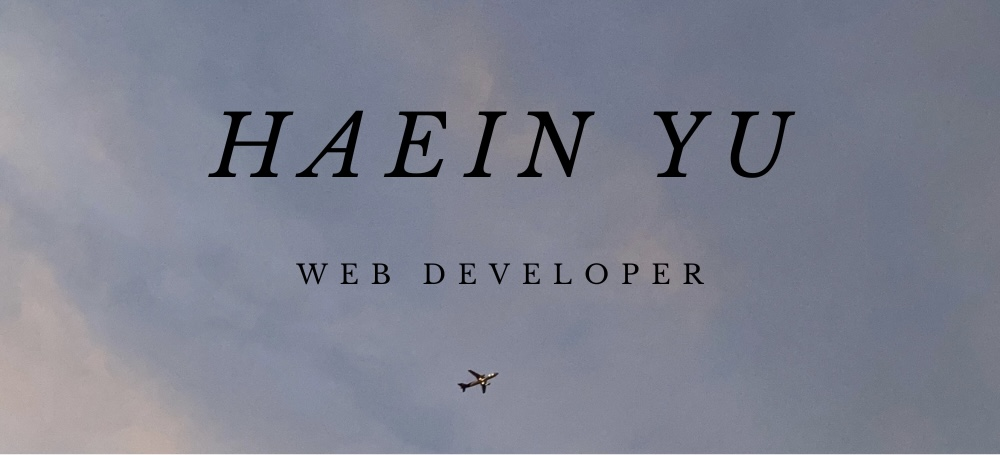

<h1 align="center">
  Let's Connect and have a Chat! 💬
</h1>

<p align="center">
  <a href="https://haeinyu.github.io/#contact">

  </a>
  <a href="mailto: jessyyu5656@gmail.com">

  </a>
  <a href="https://www.linkedin.com/in/haein-yu/">

  </a>
</p>

---

<h2> 💻 &nbsp;A Brief Introduction Of Myself</h2>

```yaml
name: Haein Yu
located_in: Philadelphia, PA, USA
current_job: Web Developer
education:
  [
    "Bachelor's in Computer Science",
    "Self-Taught Developer and Designer",
  ]
company: #Open To Work

fields_of_interests:
  [
    "Web Development",
    "UI/UX",
  ]
technical_background:
  [
    "Web Developer at Temple University SBDC",
  ]
  
currently_learning: ["React, PHP"]
2023 Goals: ["Enjoy the rest of 2023"]
hobbies: ["Swimming", "Music", "Playing_Flute", "Art"]
```
---  
  
<h2> &nbsp;Tech  Stack</h2>
<p align="left">
  
  
  
  
  
  
  
  
  
  
  
  
  
</p>


